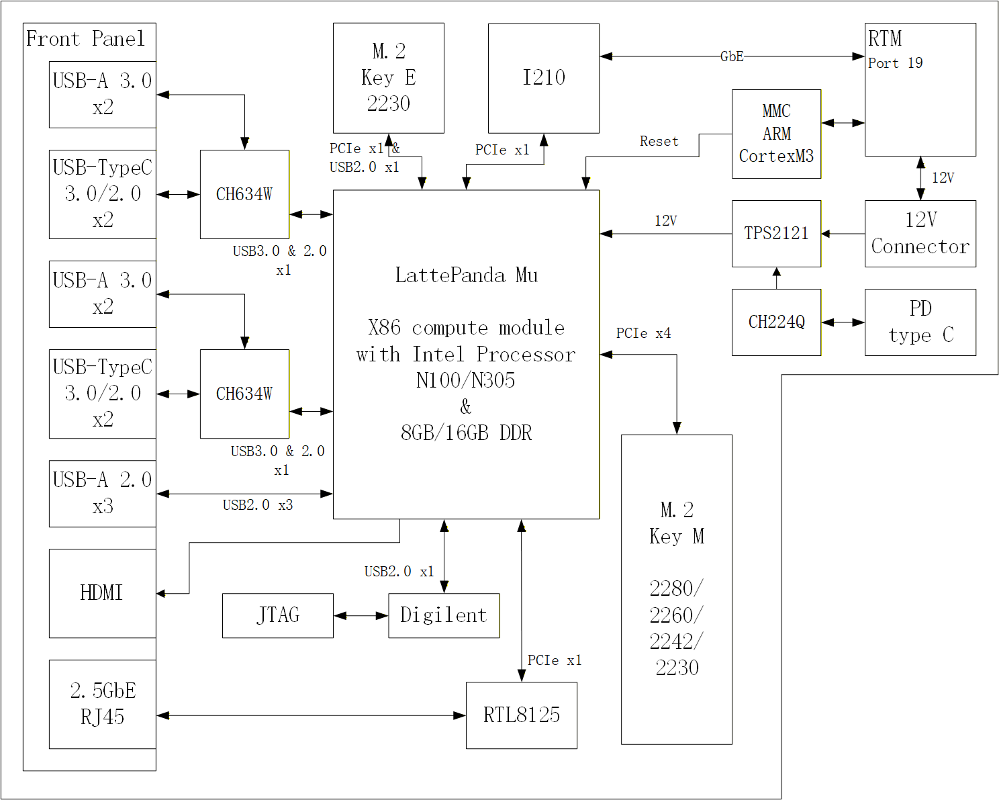

# RTM Carrier Board for LattePanda Mu

## Overview
The RTM Carrier Board for the [**LattePanda Mu X86 Compute Module**](https://www.lattepanda.com/lattepanda-mu) is compatible with the AMC RTM (Rear Transition Module) standard design, providing rich I/O expansion, advanced power management, and high-speed network connectivity.
It supports **Intel® N100/N305 processors** with 8GB or 16GB DDR memory, offering an ideal platform for embedded control, edge computing, and hardware acceleration applications.

In addition to standard interfaces such as USB, HDMI, and M.2 expansion, the board integrates a dedicated JTAG high-speed programming and debugging interface designed for MicroTCA chassis expansion, in conjunction with the **JSM (JTAG Switch Module)**.
The carrier also comes preloaded with the Xilinx Vivado design tools, enabling users to perform FPGA programming, debugging, and hardware verification directly within the system — greatly enhancing the efficiency of remote FPGA board debugging in MicroTCA-based systems.

---

## 1. Core Compute Module
- **Module:** LattePanda Mu X86 Compute Module
- **Processor:** Intel® Processor N100 / N305
- **Memory:** 8 GB or 16 GB DDR
- **Interfaces:**
  - PCIe x7
  - USB 3.0 x2
  - USB 2.0 x7
  - HDMI Output

---

## 2. Power Input and Management
- **Power Input:** 12 V DC via PD Type-C or 12 V Connector or RTM Connector
- **Power Controllers:**
  - CH224Q – USB PD Controller
  - TPS2121 – Power Path Controller (source switching)

---

## 3. Expansion Interfaces
### M.2 Slots
- **M.2 Key E (2230)**
  - Interface: PCIe x1 & USB 2.0 x1
  - Typical Use: Wi-Fi / Bluetooth Module
- **M.2 Key M (2280/2260/2242/2230)**
  - Interface: PCIe x4
  - Typical Use: NVMe SSD

---

## 4. Networking
- **Ethernet Controller 1:** Intel® I210 (1 GbE)
- **Ethernet Controller 2:** Realtek RTL8125 (2.5 GbE)
- **Ports:**
  - 1 × GbE (via RTM Port 19)
  - 1 × 2.5 GbE RJ45 (Front Panel)

---

## 5. USB Connectivity
- **Front Panel Ports:**
  - 4 × USB-A 3.0/2.0
  - 4 × USB-Type-C (USB 3.0/2.0)
  - 3 × USB-A 2.0
- **Hub Controllers:** 2 × CH634W (USB 3.0/2.0 hubs)

---

## 6. Display Interface
- **HDMI Output:** Direct connection from LattePanda Mu compute module

---

## 7. Debug & Control
- **JTAG Interface:** Connected via Digilent JTAG (USB 2.0)
- **MMC (ARM Cortex-M3):** Used for board management and reset control

---
